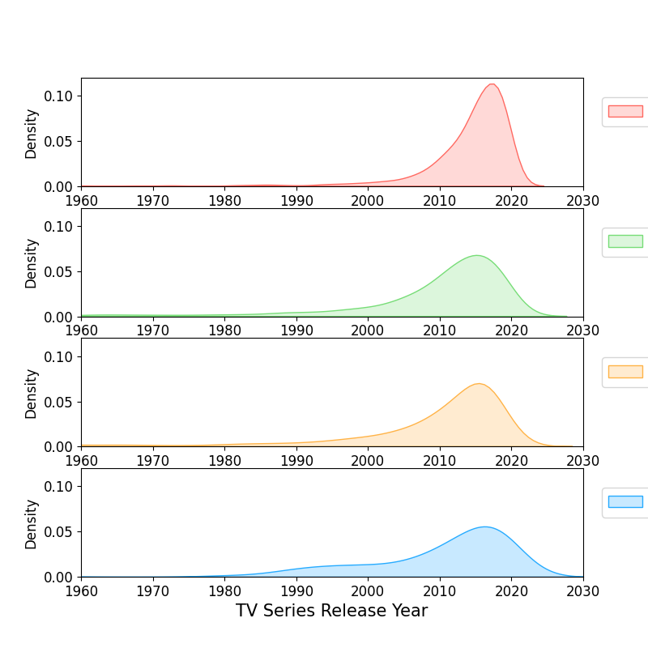

- [Import packages](#orge56c3f4)
- [Load data](#org6ad5267)
  - [Check Data of MOVIES](#orgd16f9bd)
    - [Check Data of TV](#org61e361f)
  - [Streaming Platform Breakdown](#org473ef41)
- [Settings](#org902a2a8)
- [Who has the biggest catalog?](#org2c9af16)
- [Release year breakdown of movies and TV shows in each catalog?](#org8a179fd)
- [What are the popular genres in each catalog?](#org323d966)
- [IMDb and Rotten Tomatoes Scoring per platform?](#org327263e)
- [Age of Audience Suggested?](#orgadb1e75)


<a id="orge56c3f4"></a>

# Import packages

```python
import pandas as pd
import numpy as np
import matplotlib.pyplot as plt
import seaborn as sns
```


<a id="org6ad5267"></a>

# Load data

```python
movies = pd.read_csv(
    'data/MoviesOnStreamingPlatforms_updated.csv',
    index_col=0
)
tv = pd.read_csv('data/tv_shows.csv', index_col=0)
```


<a id="orgd16f9bd"></a>

## Check Data of MOVIES

```python
movies.head()
movies.describe()
movies.isnull().sum()
```

-   Data Cleaning
    
    ```python
    movies.Age = movies.Age.fillna('Unknown')
    movies.IMDb = movies.IMDb.fillna(0)
    movies['Rotten Tomatoes'] = movies['Rotten Tomatoes'].str.rstrip('%').astype('float') # get rid of the % symbol
    movies['Rotten Tomatoes'] = movies['Rotten Tomatoes'].fillna(0)
    ```


<a id="org61e361f"></a>

### Check Data of TV

```python
tv.head()
tv.describe()
tv.isnull().sum()
```

-   Data Cleaning
    
    ```python
    tv.Age = tv.Age.fillna('Unknown')
    tv.IMDb = tv.IMDb.fillna(0)
    tv['Rotten Tomatoes'] = tv['Rotten Tomatoes'].str.rstrip('%').astype('float') # get rid of the % symbol
    tv['Rotten Tomatoes'] = tv['Rotten Tomatoes'].fillna(0)
    ```


<a id="org473ef41"></a>

## Streaming Platform Breakdown

```python
#Creating different dataframes for each platform FOR EACH SERVICE TYPE (movies or tv)
Hulu_movies = movies.loc[(movies['Hulu'] > 0) ]
Disney_movies = movies.loc[(movies['Disney+'] > 0) ]
Prime_movies = movies.loc[(movies['Prime Video'] > 0)  ]
Netflix_movies = movies.loc[(movies['Netflix'] > 0)  ]
Hulu_tv = tv.loc[(tv['Hulu'] > 0) ]
Disney_tv = tv.loc[(tv['Disney+'] > 0) ]
Prime_tv = tv.loc[(tv['Prime Video'] > 0)  ]
Netflix_tv = tv.loc[(tv['Netflix'] > 0)  ]
```


<a id="org902a2a8"></a>

# Settings

Colour Scheme per Streaming Platform

```python
n_col = '#ff6961'  #'#e50914' # red
h_col = '#77DD77'  #'#1ce783' # green
d_col = '#26abff'  #'#113CCF' # blue
p_col = '#FFB347'  #'#FF9900' # orange
```


<a id="org2c9af16"></a>

# Who has the biggest catalog?

```python
def donut(i,df,sizes,title):
    plt.subplot(i)
    plt.pie(sizes, explode=explode, labels=labels, colors=colors,
                autopct='%1.1f%%', shadow=True, startangle=0)

    #centre_circle = plt.Circle((0,0),0.5,color='black', fc='white',linewidth=1.25)
    fig = plt.gcf()
    #fig.gca().add_artist(centre_circle)
    plt.title(title, fontsize=20)
    plt.rcParams['font.size'] = 15
    plt.axis('equal')
```


-   Can we evaluate the &rsquo;unique&rsquo; movies/tv shows to each platform?
    
    ```
                                      Title  Year   Age  IMDb  Rotten Tomatoes  type
    Netflix Hulu Prime Video Disney+                                                
    0       0    0           1          156   156   156   156              156   156
                 1           0         1889  1889  1889  1889             1889  1889
            1    0           0         1452  1452  1452  1452             1452  1452
                             1           18    18    18    18               18    18
                 1           0          165   165   165   165              165   165
    1       0    0           0         1748  1748  1748  1748             1748  1748
                             1            5     5     5     5                5     5
                 1           0           59    59    59    59               59    59
            1    0           0           87    87    87    87               87    87
                             1            1     1     1     1                1     1
                 1           0           31    31    31    31               31    31
    ```


<a id="org8a179fd"></a>

# Release year breakdown of movies and TV shows in each catalog?

```python
def kde(i,dataframe,platform,c):
    plt.subplot(i)
    dataframe=dataframe.loc[dataframe[platform] == 1]
    sns.kdeplot(data=dataframe['Runtime'], color=colors[c],shade=True)
    plt.xlabel('Movie Runtime (minutes)', fontsize = 15)
    plt.xlim(0,200)
    plt.ylim(0,.03)
    plt.subplot(i+1)
    sns.kdeplot(data=dataframe['Year'], color=colors[c],shade=True)
    plt.xlabel('Movie Release Year', fontsize = 15)
    plt.xlim(1900,2040)
    plt.ylim(0,0.12)
    plt.rcParams['font.size'] = 12
    plt.legend([platform], fontsize = 15, bbox_to_anchor=(1.02,.9), loc="upper left");
```


```python
def kdetv(i,dataframe,platform,c):
    plt.subplot(i)
    dataframe=dataframe.loc[dataframe[platform] == 1]
    sns.kdeplot(data=dataframe['Year'], color=colors[c],shade=True)
    plt.xlabel('TV Series Release Year', fontsize = 15)
    plt.xlim(1960,2030)
    plt.ylim(0,0.12)
    plt.legend([platform], fontsize = 15, bbox_to_anchor=(1.02,.9), loc="upper left");
```




<a id="org323d966"></a>

# What are the popular genres in each catalog?

```python
#creating helper function that receives a column and returns a new dataframe
#containing bolean values for each possible option

def split_multicolumn(genres):
    result_df = genres.to_frame()
    options = []
    # Iterate over the column
    for idx, value  in genres[genres.notnull()].items():
        # Break each value into list of options
        for option in value.split(','):
            # Add the option as a column to result
            if not option in result_df.columns:
                options.append(option)
                result_df[option] = False
            # Mark the value in the option column as True
            result_df.at[idx, option] = True
    return result_df[options]
```

```python
mGenres = split_multicolumn(movies.Genres)
Hulu_mG = Hulu_movies.join(mGenres)
Netflix_mG = Netflix_movies.join(mGenres)
Prime_mG = Prime_movies.join(mGenres)
Disney_mG = Disney_movies.join(mGenres)
```


```python
genre_col = movie_genres.index.tolist()
```

```python
Hulu_mG = Hulu_mG[genre_col]
Netflix_mG = Netflix_mG[genre_col]
Prime_mG = Prime_mG[genre_col]
Disney_mG = Disney_mG[genre_col]

#since each dataframe above contains only boolean values, now we can use sum() to find
#the quantities for each platform and save it into a new variable we will use in our barplot:
hulu_genres_list = Hulu_mG.sum().sort_values(ascending=False).head(10)/sum(Hulu_mG.sum())*100
netflix_genres_list = Netflix_mG.sum().sort_values(ascending=False).head(10)/sum(Netflix_mG.sum())*100
primevideo_genres_list = Prime_mG.sum().sort_values(ascending=False).head(10)/sum(Prime_mG.sum())*100
disney_genres_list = Disney_mG.sum().sort_values(ascending=False).head(10)/sum(Disney_mG.sum())*100
```


<a id="org327263e"></a>

# IMDb and Rotten Tomatoes Scoring per platform?

```python
Hulu_mIMDb = Hulu_movies.loc[Hulu_movies['IMDb']>0]
Netflix_mIMDb = Netflix_movies.loc[Netflix_movies['IMDb']>0]
Prime_mIMDb = Prime_movies.loc[Prime_movies['IMDb']>0]
Disney_mIMDb = Disney_movies.loc[Disney_movies['IMDb']>0]

Hulu_mRotten = Hulu_movies.loc[Hulu_movies['Rotten Tomatoes']>0]
Netflix_mRotten = Netflix_movies.loc[Netflix_movies['Rotten Tomatoes']>0]
Prime_mRotten = Prime_movies.loc[Prime_movies['Rotten Tomatoes']>0]
Disney_mRotten = Disney_movies.loc[Disney_movies['Rotten Tomatoes']>0]

Hulu_tvIMDb = Hulu_tv.loc[Hulu_tv['IMDb']>0]
Netflix_tvIMDb = Netflix_tv.loc[Netflix_tv['IMDb']>0]
Prime_tvIMDb = Prime_tv.loc[Prime_tv['IMDb']>0]
Disney_tvIMDb = Disney_tv.loc[Disney_tv['IMDb']>0]

Hulu_tvRotten = Hulu_tv.loc[Hulu_tv['Rotten Tomatoes']>0]
Netflix_tvRotten = Netflix_tv.loc[Netflix_tv['Rotten Tomatoes']>0]
Prime_tvRotten = Prime_tv.loc[Prime_tv['Rotten Tomatoes']>0]
Disney_tvRotten = Disney_tv.loc[Disney_tv['Rotten Tomatoes']>0]
```


```python
Hulu_mIMDb = Hulu_movies.loc[Hulu_movies['IMDb']>=8]
Netflix_mIMDb = Netflix_movies.loc[Netflix_movies['IMDb']>=8]
Prime_mIMDb = Prime_movies.loc[Prime_movies['IMDb']>=8]
Disney_mIMDb = Disney_movies.loc[Disney_movies['IMDb']>=8]

Hulu_mRotten = Hulu_movies.loc[Hulu_movies['Rotten Tomatoes']>=80]
Netflix_mRotten = Netflix_movies.loc[Netflix_movies['Rotten Tomatoes']>=80]
Prime_mRotten = Prime_movies.loc[Prime_movies['Rotten Tomatoes']>=80]
Disney_mRotten = Disney_movies.loc[Disney_movies['Rotten Tomatoes']>=80]

Hulu_tvIMDb = Hulu_tv.loc[Hulu_tv['IMDb']>=8]
Netflix_tvIMDb = Netflix_tv.loc[Netflix_tv['IMDb']>=8]
Prime_tvIMDb = Prime_tv.loc[Prime_tv['IMDb']>=8]
Disney_tvIMDb = Disney_tv.loc[Disney_tv['IMDb']>=8]

Hulu_tvRotten = Hulu_tv.loc[Hulu_tv['Rotten Tomatoes']>=80]
Netflix_tvRotten = Netflix_tv.loc[Netflix_tv['Rotten Tomatoes']>=80]
Prime_tvRotten = Prime_tv.loc[Prime_tv['Rotten Tomatoes']>=80]
Disney_tvRotten = Disney_tv.loc[Disney_tv['Rotten Tomatoes']>=80]
```


<a id="orgadb1e75"></a>

# Age of Audience Suggested?

```python
hulu_mages = Hulu_movies.Age.value_counts().drop('Unknown')
netflix_mages = Netflix_movies.Age.value_counts().drop('Unknown')
primevideo_mages = Prime_movies.Age.value_counts().drop('Unknown')
disney_mages = Disney_movies.Age.value_counts().drop('Unknown')

hulu_tvages = Hulu_tv.Age.value_counts().drop('Unknown')
netflix_tvages = Netflix_tv.Age.value_counts().drop('Unknown')
primevideo_tvages = Prime_tv.Age.value_counts().drop('Unknown')
disney_tvages = Disney_tv.Age.value_counts().drop('Unknown')
```


