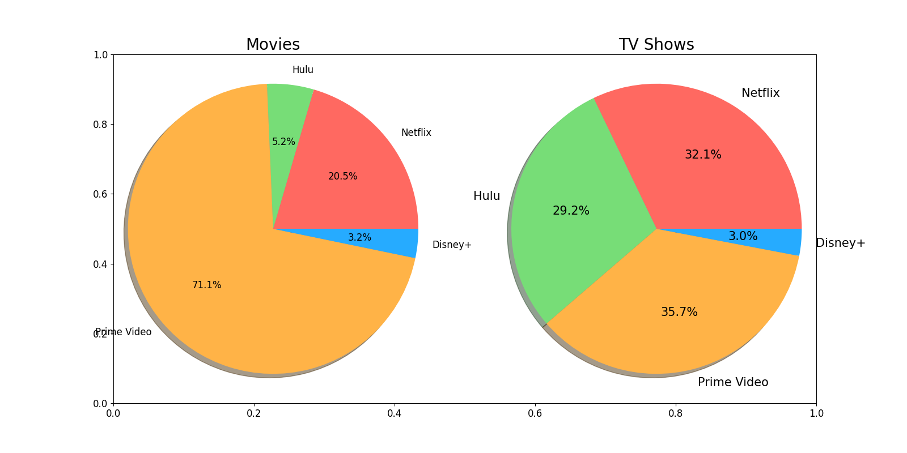
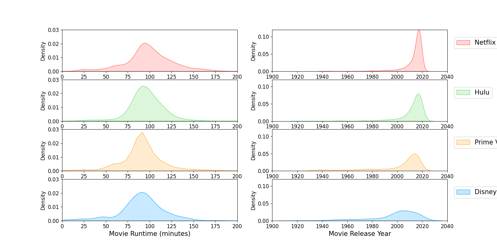
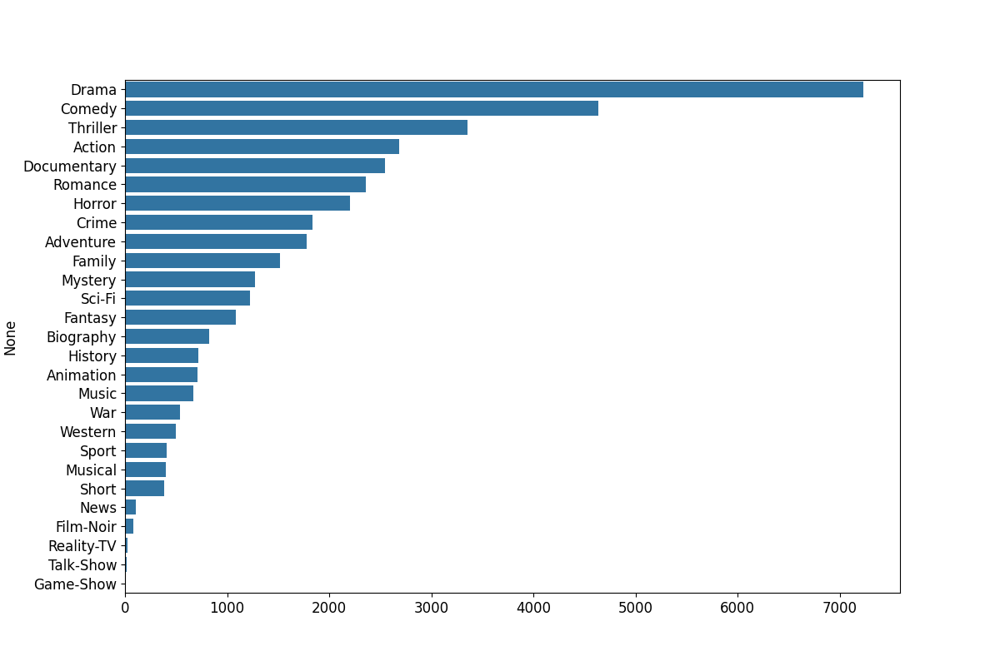
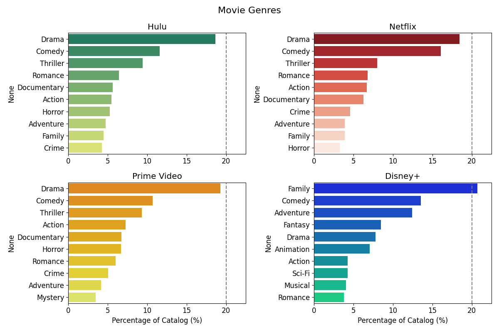
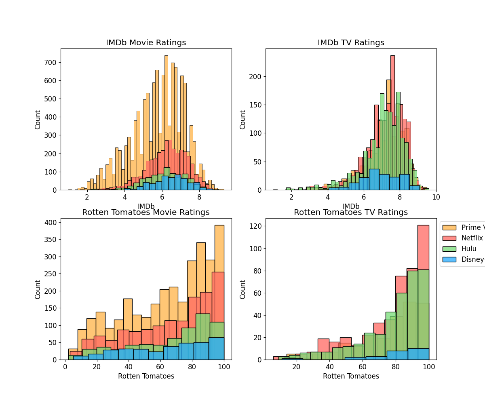
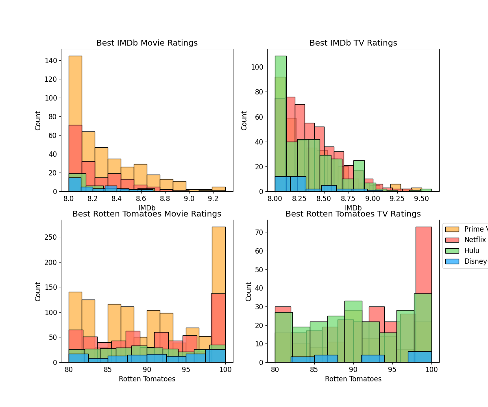
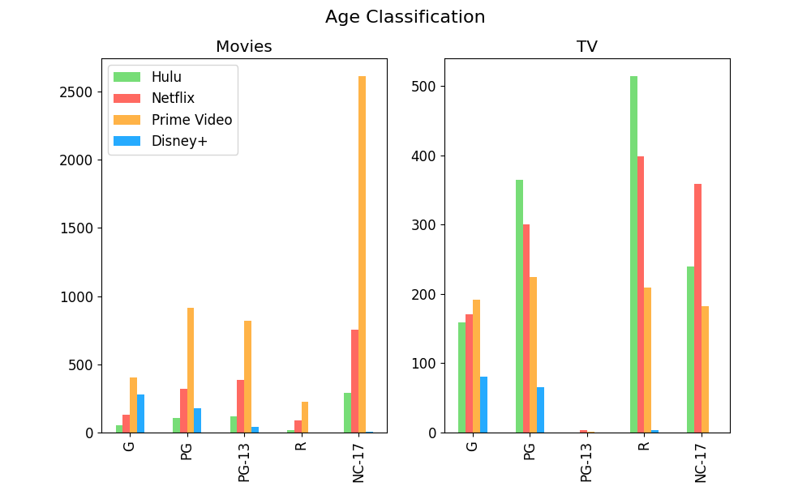

- [Setup](#org8f5be98)
  - [Import packages](#org3bb9904)
  - [Colour Scheme per Streaming Platform](#org6b553ff)
- [Load data](#org227d93b)
- [Prepare data](#org8e852bb)
  - [Data Cleaning - Movies](#orgc875bc9)
  - [Data Cleaning - TV](#org85b6c65)
  - [Streaming Platform Breakdown](#org070827c)
- [Analysis](#org67627ac)
  - [Who has the biggest catalog?](#org95d4560)
  - [Release year breakdown of movies and TV shows in each catalog?](#orge8b340d)
  - [What are the popular genres in each catalog?](#orga714f80)
  - [IMDb and Rotten Tomatoes Scoring per platform?](#orgec8a512)
  - [Age of Audience Suggested?](#orge451e99)


<a id="org8f5be98"></a>

# Setup


<a id="org3bb9904"></a>

## Import packages

```python
import pandas as pd
import numpy as np
import matplotlib.pyplot as plt
import seaborn as sns
```


<a id="org6b553ff"></a>

## Colour Scheme per Streaming Platform

```python
n_col = '#ff6961'  #'#e50914' # red - Netflix
h_col = '#77DD77'  #'#1ce783' # green - Hulu
d_col = '#26abff'  #'#113CCF' # blue - Disney+
p_col = '#FFB347'  #'#FF9900' # orange - Prime Video
```


<a id="org227d93b"></a>

# Load data

```python
movies = pd.read_csv('data/MoviesOnStreamingPlatforms_updated.csv', index_col=0)
tv = pd.read_csv('data/tv_shows.csv', index_col=0)
```


<a id="org8e852bb"></a>

# Prepare data


<a id="orgc875bc9"></a>

## Data Cleaning - Movies

```python
movies.Age = movies.Age.fillna('Unknown')
movies.IMDb = movies.IMDb.fillna(0)
movies['Rotten Tomatoes'] = movies['Rotten Tomatoes'].str.rstrip('%').astype('float') # get rid of the % symbol
movies['Rotten Tomatoes'] = movies['Rotten Tomatoes'].fillna(0)
```


<a id="org85b6c65"></a>

## Data Cleaning - TV

```python
tv.Age = tv.Age.fillna('Unknown')
tv.IMDb = tv.IMDb.fillna(0)
tv['Rotten Tomatoes'] = tv['Rotten Tomatoes'].str.rstrip('%').astype('float') # get rid of the % symbol
tv['Rotten Tomatoes'] = tv['Rotten Tomatoes'].fillna(0)
```


<a id="org070827c"></a>

## Streaming Platform Breakdown

```python
#Creating different dataframes for each platform FOR EACH SERVICE TYPE (movies or tv)
Hulu_movies = movies.loc[(movies['Hulu'] > 0) ]
Disney_movies = movies.loc[(movies['Disney+'] > 0) ]
Prime_movies = movies.loc[(movies['Prime Video'] > 0)  ]
Netflix_movies = movies.loc[(movies['Netflix'] > 0)  ]
Hulu_tv = tv.loc[(tv['Hulu'] > 0) ]
Disney_tv = tv.loc[(tv['Disney+'] > 0) ]
Prime_tv = tv.loc[(tv['Prime Video'] > 0)  ]
Netflix_tv = tv.loc[(tv['Netflix'] > 0)  ]
```


<a id="org67627ac"></a>

# Analysis


<a id="org95d4560"></a>

## Who has the biggest catalog?

```python
def donut(i,df,sizes,title):
    plt.subplot(i)
    plt.pie(sizes, explode=explode, labels=labels, colors=colors,
                autopct='%1.1f%%', shadow=True, startangle=0)

    #centre_circle = plt.Circle((0,0),0.5,color='black', fc='white',linewidth=1.25)
    fig = plt.gcf()
    #fig.gca().add_artist(centre_circle)
    plt.title(title, fontsize=20)
    plt.rcParams['font.size'] = 15
    plt.axis('equal')
```

```python
def val_sum(df,c):
    return df[c].sum(axis=0)

val_counts = []
dfs = [movies,tv]
cols = ['Netflix','Hulu','Prime Video','Disney+']

for x in dfs:
    for y in cols:
        val_counts.append(val_sum(x,y))

fig = plt.subplots(figsize=(16, 8))
labels = 'Netflix', 'Hulu','Prime Video','Disney+'
sizes1 = [val_counts[0], val_counts[1],val_counts[2],val_counts[3]]
sizes2 = [val_counts[4], val_counts[5],val_counts[6],val_counts[7]]
colors = [n_col, h_col, p_col, d_col]
explode = (0, 0, 0, 0)

donut(121,movies,sizes1,'Movies')
donut(122,tv,sizes2,'TV Shows')
#plt.show()
plt.savefig(f)
f
```



-   **Can we evaluate the &rsquo;unique&rsquo; movies/tv shows to each platform?**
    
    ```python
    tv.groupby(['Netflix','Hulu','Prime Video','Disney+']).count()
    ```


<a id="orge8b340d"></a>

## Release year breakdown of movies and TV shows in each catalog?

```python
def kde(i,dataframe,platform,c):
    plt.subplot(i)
    dataframe=dataframe.loc[dataframe[platform] == 1]
    sns.kdeplot(data=dataframe['Runtime'], color=colors[c],shade=True)
    plt.xlabel('Movie Runtime (minutes)', fontsize = 15)
    plt.xlim(0,200)
    plt.ylim(0,.03)
    plt.subplot(i+1)
    sns.kdeplot(data=dataframe['Year'], color=colors[c],shade=True)
    plt.xlabel('Movie Release Year', fontsize = 15)
    plt.xlim(1900,2040)
    plt.ylim(0,0.12)
    plt.rcParams['font.size'] = 12
    plt.legend([platform], fontsize = 15, bbox_to_anchor=(1.02,.9), loc="upper left");
```

```python
plt.figure(figsize = (16, 8))
kde(421,movies,'Netflix',0)
kde(423,movies,'Hulu',1)
kde(425,movies,'Prime Video',2)
kde(427,movies,'Disney+',3)
plt.savefig(f)
f
```



```python
def kdetv(i,dataframe,platform,c):
    plt.subplot(i)
    dataframe=dataframe.loc[dataframe[platform] == 1]
    sns.kdeplot(data=dataframe['Year'], color=colors[c],shade=True)
    plt.xlabel('TV Series Release Year', fontsize = 15)
    plt.xlim(1960,2030)
    plt.ylim(0,0.12)
    plt.legend([platform], fontsize = 15, bbox_to_anchor=(1.02,.9), loc="upper left");
```

```python
plt.figure(figsize = (8, 8));

kdetv(411,tv,'Netflix',0);
kdetv(412,tv,'Hulu',1);
kdetv(413,tv,'Prime Video',2);
kdetv(414,tv,'Disney+',3);
plt.savefig(f)
f
```


<a id="orga714f80"></a>

## What are the popular genres in each catalog?

```python
#creating helper function that receives a column and returns a new dataframe
#containing bolean values for each possible option

def split_multicolumn(genres):
    result_df = genres.to_frame()
    options = []
    # Iterate over the column
    for idx, value  in genres[genres.notnull()].items():
        # Break each value into list of options
        for option in value.split(','):
            # Add the option as a column to result
            if not option in result_df.columns:
                options.append(option)
                result_df[option] = False
            # Mark the value in the option column as True
            result_df.at[idx, option] = True
    return result_df[options]
```

```python
mGenres = split_multicolumn(movies.Genres)
Hulu_mG = Hulu_movies.join(mGenres)
Netflix_mG = Netflix_movies.join(mGenres)
Prime_mG = Prime_movies.join(mGenres)
Disney_mG = Disney_movies.join(mGenres)
```

```python
#performing a sum operation of all True values
movie_genres = mGenres.sum().sort_values(ascending=False)
#plotting into a bar plot
plt.figure(figsize=(12,8))
sns.barplot(x=movie_genres.values, y=movie_genres.index)
plt.savefig(f)
f
```



```python
genre_col = movie_genres.index.tolist()
```

```python
Hulu_mG = Hulu_mG[genre_col]
Netflix_mG = Netflix_mG[genre_col]
Prime_mG = Prime_mG[genre_col]
Disney_mG = Disney_mG[genre_col]

#since each dataframe above contains only boolean values, now we can use sum() to find
#the quantities for each platform and save it into a new variable we will use in our barplot:
hulu_genres_list = Hulu_mG.sum().sort_values(ascending=False).head(10)/sum(Hulu_mG.sum())*100
netflix_genres_list = Netflix_mG.sum().sort_values(ascending=False).head(10)/sum(Netflix_mG.sum())*100
primevideo_genres_list = Prime_mG.sum().sort_values(ascending=False).head(10)/sum(Prime_mG.sum())*100
disney_genres_list = Disney_mG.sum().sort_values(ascending=False).head(10)/sum(Disney_mG.sum())*100
```

```python
#creating subplots to show each data into a different ax
fix, axes = plt.subplots(2,2, figsize=(12,8));

#setting titles
axes[0,0].set_title('Hulu');
axes[0,0].set_xlim(0,22.5);
axes[0,1].set_title('Netflix');
axes[0,1].set_xlim(0,22.5);
axes[1,0].set_title('Prime Video');
axes[1,0].set_xlim(0,22.5);
axes[1,0].set_xlabel('Percentage of Catalog (%)');
axes[1,1].set_title('Disney+');
axes[1,1].set_xlim(0,22.5);
axes[1,1].set_xlabel('Percentage of Catalog (%)');
fix.suptitle('Movie Genres', fontsize=16)
#plotting the four barplots using seaborn
sns.barplot(y=hulu_genres_list.index, x=hulu_genres_list.values, ax=axes[0,0],palette='summer');
axes[0,0].axvline(20, color='grey', linestyle='--')
sns.barplot(y=netflix_genres_list.index, x=netflix_genres_list.values, ax=axes[0,1], palette='Reds_r');
axes[0,1].axvline(20, color='grey', linestyle='--')
sns.barplot(y=primevideo_genres_list.index, x=primevideo_genres_list.values, ax=axes[1,0], palette='Wistia_r');
axes[1,0].axvline(20, color='grey', linestyle='--')
sns.barplot(y=disney_genres_list.index, x=disney_genres_list.values, ax=axes[1,1], palette='winter');
plt.tight_layout();
axes[1,1].axvline(20, color='grey', linestyle='--')
# plt.show();
plt.savefig(f)
f
```




<a id="orgec8a512"></a>

## IMDb and Rotten Tomatoes Scoring per platform?

```python
Hulu_mIMDb = Hulu_movies.loc[Hulu_movies['IMDb']>0]
Netflix_mIMDb = Netflix_movies.loc[Netflix_movies['IMDb']>0]
Prime_mIMDb = Prime_movies.loc[Prime_movies['IMDb']>0]
Disney_mIMDb = Disney_movies.loc[Disney_movies['IMDb']>0]

Hulu_mRotten = Hulu_movies.loc[Hulu_movies['Rotten Tomatoes']>0]
Netflix_mRotten = Netflix_movies.loc[Netflix_movies['Rotten Tomatoes']>0]
Prime_mRotten = Prime_movies.loc[Prime_movies['Rotten Tomatoes']>0]
Disney_mRotten = Disney_movies.loc[Disney_movies['Rotten Tomatoes']>0]

Hulu_tvIMDb = Hulu_tv.loc[Hulu_tv['IMDb']>0]
Netflix_tvIMDb = Netflix_tv.loc[Netflix_tv['IMDb']>0]
Prime_tvIMDb = Prime_tv.loc[Prime_tv['IMDb']>0]
Disney_tvIMDb = Disney_tv.loc[Disney_tv['IMDb']>0]

Hulu_tvRotten = Hulu_tv.loc[Hulu_tv['Rotten Tomatoes']>0]
Netflix_tvRotten = Netflix_tv.loc[Netflix_tv['Rotten Tomatoes']>0]
Prime_tvRotten = Prime_tv.loc[Prime_tv['Rotten Tomatoes']>0]
Disney_tvRotten = Disney_tv.loc[Disney_tv['Rotten Tomatoes']>0]
```

```python
#Defining plot size and title
fig,ax = plt.subplots(2,2, figsize=(12,10))

ax[0,0].set_title('IMDb Movie Ratings');
ax[0,1].set_title('IMDb TV Ratings');
ax[1,0].set_title('Rotten Tomatoes Movie Ratings');
ax[1,1].set_title('Rotten Tomatoes TV Ratings');

#Plotting the information from each dataset into a KDE plot
sns.histplot(data=Prime_mIMDb['IMDb'], color=p_col, ax=ax[0,0]);
sns.histplot(data=Netflix_mIMDb['IMDb'], color=n_col,  ax=ax[0,0]);
sns.histplot(data=Hulu_mIMDb['IMDb'], color=h_col,  ax=ax[0,0]);
sns.histplot(data=Disney_mIMDb['IMDb'], color=d_col, ax=ax[0,0]);

sns.histplot(data=Prime_mRotten['Rotten Tomatoes'], color=p_col, ax=ax[1,0]);
sns.histplot(data=Netflix_mRotten['Rotten Tomatoes'], color=n_col,  ax=ax[1,0]);
sns.histplot(data=Hulu_mRotten['Rotten Tomatoes'], color=h_col,  ax=ax[1,0]);
sns.histplot(data=Disney_mRotten['Rotten Tomatoes'], color=d_col, ax=ax[1,0]);

sns.histplot(data=Prime_tvIMDb['IMDb'], color=p_col, legend=True, ax=ax[0,1]);
sns.histplot(data=Netflix_tvIMDb['IMDb'], color=n_col,  legend=True, ax=ax[0,1]);
sns.histplot(data=Hulu_tvIMDb['IMDb'], color=h_col,  legend=True, ax=ax[0,1]);
sns.histplot(data=Disney_tvIMDb['IMDb'], color=d_col, legend=True, ax=ax[0,1]);

sns.histplot(data=Prime_tvRotten['Rotten Tomatoes'], color=p_col, ax=ax[1,1]);
sns.histplot(data=Netflix_tvRotten['Rotten Tomatoes'], color=n_col, ax=ax[1,1]);
sns.histplot(data=Hulu_tvRotten['Rotten Tomatoes'], color=h_col, ax=ax[1,1]);
sns.histplot(data=Disney_tvRotten['Rotten Tomatoes'], color=d_col, ax=ax[1,1]);

#Setting the legend
plt.legend(['Prime Video', 'Netflix', 'Hulu', 'Disney+'], bbox_to_anchor=(1,1));
# plt.show();
plt.savefig(f)
f
```



```python
Hulu_mIMDb = Hulu_movies.loc[Hulu_movies['IMDb']>=8]
Netflix_mIMDb = Netflix_movies.loc[Netflix_movies['IMDb']>=8]
Prime_mIMDb = Prime_movies.loc[Prime_movies['IMDb']>=8]
Disney_mIMDb = Disney_movies.loc[Disney_movies['IMDb']>=8]

Hulu_mRotten = Hulu_movies.loc[Hulu_movies['Rotten Tomatoes']>=80]
Netflix_mRotten = Netflix_movies.loc[Netflix_movies['Rotten Tomatoes']>=80]
Prime_mRotten = Prime_movies.loc[Prime_movies['Rotten Tomatoes']>=80]
Disney_mRotten = Disney_movies.loc[Disney_movies['Rotten Tomatoes']>=80]

Hulu_tvIMDb = Hulu_tv.loc[Hulu_tv['IMDb']>=8]
Netflix_tvIMDb = Netflix_tv.loc[Netflix_tv['IMDb']>=8]
Prime_tvIMDb = Prime_tv.loc[Prime_tv['IMDb']>=8]
Disney_tvIMDb = Disney_tv.loc[Disney_tv['IMDb']>=8]

Hulu_tvRotten = Hulu_tv.loc[Hulu_tv['Rotten Tomatoes']>=80]
Netflix_tvRotten = Netflix_tv.loc[Netflix_tv['Rotten Tomatoes']>=80]
Prime_tvRotten = Prime_tv.loc[Prime_tv['Rotten Tomatoes']>=80]
Disney_tvRotten = Disney_tv.loc[Disney_tv['Rotten Tomatoes']>=80]
```

```python
#Defining plot size and title
fig,ax = plt.subplots(2,2, figsize=(12,10))

ax[0,0].set_title('Best IMDb Movie Ratings');
ax[0,1].set_title('Best IMDb TV Ratings');
ax[1,0].set_title('Best Rotten Tomatoes Movie Ratings');
ax[1,1].set_title('Best Rotten Tomatoes TV Ratings');

#Plotting the information from each dataset into a KDE plot
sns.histplot(data=Prime_mIMDb['IMDb'], color=p_col, ax=ax[0,0]);
sns.histplot(data=Netflix_mIMDb['IMDb'], color=n_col,  ax=ax[0,0]);
sns.histplot(data=Hulu_mIMDb['IMDb'], color=h_col,  ax=ax[0,0]);
sns.histplot(data=Disney_mIMDb['IMDb'], color=d_col, ax=ax[0,0]);

sns.histplot(data=Prime_mRotten['Rotten Tomatoes'], color=p_col, ax=ax[1,0]);
sns.histplot(data=Netflix_mRotten['Rotten Tomatoes'], color=n_col,  ax=ax[1,0]);
sns.histplot(data=Hulu_mRotten['Rotten Tomatoes'], color=h_col,  ax=ax[1,0]);
sns.histplot(data=Disney_mRotten['Rotten Tomatoes'], color=d_col, ax=ax[1,0]);

sns.histplot(data=Prime_tvIMDb['IMDb'], color=p_col, legend=True, ax=ax[0,1]);
sns.histplot(data=Netflix_tvIMDb['IMDb'], color=n_col,  legend=True, ax=ax[0,1]);
sns.histplot(data=Hulu_tvIMDb['IMDb'], color=h_col,  legend=True, ax=ax[0,1]);
sns.histplot(data=Disney_tvIMDb['IMDb'], color=d_col, legend=True, ax=ax[0,1]);

sns.histplot(data=Prime_tvRotten['Rotten Tomatoes'], color=p_col, ax=ax[1,1]);
sns.histplot(data=Netflix_tvRotten['Rotten Tomatoes'], color=n_col, ax=ax[1,1]);
sns.histplot(data=Hulu_tvRotten['Rotten Tomatoes'], color=h_col, ax=ax[1,1]);
sns.histplot(data=Disney_tvRotten['Rotten Tomatoes'], color=d_col, ax=ax[1,1]);

#Setting the legend
plt.legend(['Prime Video', 'Netflix', 'Hulu', 'Disney+'], bbox_to_anchor=(1,1))
# plt.show();
plt.savefig(f)
f
```




<a id="orge451e99"></a>

## Age of Audience Suggested?

```python
hulu_mages = Hulu_movies.Age.value_counts().drop('Unknown')
netflix_mages = Netflix_movies.Age.value_counts().drop('Unknown')
primevideo_mages = Prime_movies.Age.value_counts().drop('Unknown')
disney_mages = Disney_movies.Age.value_counts().drop('Unknown')

hulu_tvages = Hulu_tv.Age.value_counts().drop('Unknown')
netflix_tvages = Netflix_tv.Age.value_counts().drop('Unknown')
primevideo_tvages = Prime_tv.Age.value_counts().drop('Unknown')
disney_tvages = Disney_tv.Age.value_counts().drop('Unknown')
```

```python
x = ['G','PG','PG-13','R','NC-17']

#is this the best code? NO. But it will work in a pinch for this one purpose **only**...
hulu_mov = [55,109,119,17,290]
net_mov = [130,323,383,89,752]
prim_mov = [406,916,819,226,2612]
dis_mov = [277,179,40,1,3]

hulu_tv = [159,365,0,514,239]
net_tv = [171,300,3,398,359]
prim_tv = [192,224,1,209,182]
dis_tv = [81,66,0,3,0]

mov_age = pd.DataFrame([['G',55,130,406,277],['PG',109,323,916,179],['PG-13',119,383,819,40],['R',17,89,226,1],['NC-17',290,752,2612,3]],
                      columns=['Rating','Hulu','Netflix','Prime Video','Disney+'])

tv_age = pd.DataFrame([['G',159,171,192,81],['PG',365,300,224,66],['PG-13',0,3,1,0],['R',514,398,209,3],['NC-17',239,359,182,0]],
                      columns=['Rating','Hulu','Netflix','Prime Video','Disney+'])

colors = [h_col, n_col, p_col, d_col]

fig, axes = plt.subplots(nrows=1, ncols=2, figsize=(10,6));
mov_age.plot(x='Rating', ax=axes[0], kind='bar', title='Movies', color=colors);
tv_age.plot(x='Rating', ax=axes[1], kind='bar', title='TV', color=colors, legend=False);
fig.suptitle('Age Classification *', fontsize=16);
axes[0].set_xlabel('');
axes[1].set_xlabel('');

# annotations
fig.text(0.11, -.12, '* G – General Audiences - All ages admitted.\n  PG – Parental Guidance Suggested - Some material may not be suitable for children. (7+)\n  PG-13 – Parents Strongly Cautioned - Some material may be inappropriate for children under 13. (13+)\n  R – Restricted - Under 17 requires accompanying parent or adult guardian. (16+)\n  NC-17 – Adults Only - No One 17 and Under Admitted. (18+)', ha='left');
fig.savefig(f)
f
```


